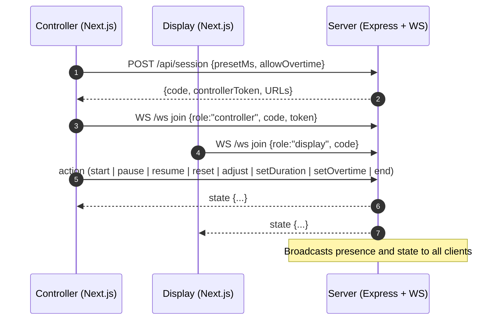

## Stagetimer (Web)

Problem: Live talks and rehearsals slip without a simple, shared clock.
Solution: A zero-setup, browser-based stage timer with one controller and unlimited displays, synchronized in real time.

### What this is
Stagetimer Web is a Next.js app backed by a tiny Express + WebSocket server. A presenter or stage manager creates a session (controller) and others join as displays using a short code. The controller starts/pauses/resets the clock, adjusts time, and toggles overtime while all connected displays stay perfectly in sync.

### Highlights
- Real-time sync via WebSockets (`ws`)
- One active controller per session; many displays
- 6-character session codes; no accounts, no DB
- Presets, manual minute/second inputs, ±30s adjust
- Overtime toggle and presence counts
- Tailwind CSS v4 styles, React 19, Next.js 15 (App Router)

---

## Quick start

Prerequisites:
- Node.js 18+ (or Bun latest)
- Free ports: 3000 (web) and 8787 (API/WS)

Install dependencies:
```bash
npm install
# or
bun install
```

Run web and server together (recommended during development):
```bash
npm run dev:all
# or with Bun
npm run dev:all:bun
```

Open `http://localhost:3000`.

---

## Scripts
- `dev`: Next.js dev server (Turbopack)
- `server`: Express + WebSocket server on port 8787
- `dev:all`: Run both server and web concurrently
- `build`: Production build for the web app
- `start`: Start the built Next.js app
- `lint`: Lint the codebase

---

## Tech stack
- Next.js 15 (App Router), React 19, TypeScript
- Tailwind CSS v4
- Express (REST) + `ws` (WebSocket)
- ESLint (flat config)

---

## Environment configuration

Server (`server/server.js`):
- `PORT` (default `8787`): API/WS port
- `PUBLIC_ORIGIN` (default `http://localhost:3000`): allowed origin when CORS is restricted
- `CORS_ALLOW_ALL` (`1` to allow all; default allows all in non-production)
- `SESSION_TTL_MINUTES` (default `120`): session time-to-live
- `SESSION_CODE_ALPHABET` (default `23456789ABCDEFGHJKMNPQRSTUVWXYZ`)

Client (`src/lib/wsClient.ts`):
- `NEXT_PUBLIC_API_URL` (e.g., `https://api.example.com:8787`)
- `NEXT_PUBLIC_WS_URL` (e.g., `wss://api.example.com:8787/ws`)

If these client env vars are not set, the app infers API/WS URLs from the current browser location using port `8787`.

---

## Production

Build the web app and run both services:
```bash
npm run build
npm run start       # Next.js on :3000
node server/server.js  # Express+WS on :8787
```

Recommended:
- Put the API/WS behind TLS and a reverse proxy (e.g., Nginx) and set `NEXT_PUBLIC_API_URL` / `NEXT_PUBLIC_WS_URL` accordingly
- Lock down CORS with `PUBLIC_ORIGIN` and disable `CORS_ALLOW_ALL`
- Use a process manager for the Node server (e.g., PM2, systemd)

---

## Features in detail

Frontend routes:
- `/` home: create or join
- `/control` controller: creates a new session, shows code, performs actions
- `/display?code=ABC123` display: shows the big timer synced to the session

Presence and control:
- One active controller per session (enforced on the server)
- Any number of displays can join by code
- Actions: start, pause, resume, reset, set duration, ±30s adjust, toggle overtime, end session

Timing accuracy:
- Server sends `serverNow` timestamps; client computes `clockOffsetMs` to animate smoothly between authoritative state updates

---

## API

### Health
`GET /api/health`
Response: `{ "ok": true }`

### Create session
`POST /api/session`

Request body:
```json
{ "presetMs": 300000, "allowOvertime": false }
```

Response body:
```json
{
  "code": "ABC123",
  "controllerToken": "<secret>",
  "controlUrl": "/control?code=ABC123&token=<secret>",
  "displayUrl": "/display?code=ABC123"
}
```

---

## WebSocket protocol

Endpoint: `GET /ws`

Client messages:
```json
{ "type": "join", "role": "controller", "code": "ABC123", "token": "<secret>" }
{ "type": "join", "role": "display", "code": "ABC123" }
{ "type": "action", "action": "start" }
{ "type": "action", "action": "pause" }
{ "type": "action", "action": "resume" }
{ "type": "action", "action": "reset", "payload": { "presetMs": 300000 } }
{ "type": "action", "action": "adjust", "payload": { "deltaMs": 30000 } }
{ "type": "action", "action": "setDuration", "payload": { "ms": 600000 } }
{ "type": "action", "action": "setOvertime", "payload": { "value": true } }
{ "type": "action", "action": "end" }
```

Server messages:
```json
{ "type": "joined", "role": "controller", "code": "ABC123", "counts": { "controllers": 1, "displays": 2 } }
{ "type": "presence", "counts": { "controllers": 1, "displays": 2 } }
{ "type": "state", "code": "ABC123", "status": "running", "presetDurationMs": 300000, "startTime": 1730000000000, "pauseAccumulatedMs": 0, "allowOvertime": false, "serverNow": 1730000001000 }
{ "type": "error", "message": "Session not found" }
```

Rules:
- Only a controller with the correct `controllerToken` can send actions
- If another controller is active, joins will be rejected
- All state changes broadcast to controllers and displays

---

## Architecture (Mermaid)



---

## Folder structure (high level)
```text
web/
├─ server/
│  └─ server.js          # REST + WS (no DB)
├─ src/
│  ├─ app/
│  │  ├─ page.tsx        # Home
│  │  ├─ control/page.tsx
│  │  └─ display/page.tsx
│  └─ lib/
│     ├─ wsClient.ts     # API/WS URL helpers & types
│     └─ time.ts         # formatDuration
├─ next.config.ts
├─ postcss.config.mjs
├─ eslint.config.mjs
└─ package.json
```

---

## Notes & limitations
- Sessions are in-memory; restarting the server clears them
- Intended for trusted networks; put behind TLS/proxy for internet use
- CORS defaults to permissive in non-production; lock it down in prod

---

## Contributing
Issues and PRs are welcome. Please run `npm run lint` before submitting.

## License
Add your project's license here (e.g., MIT). If none is specified, all rights reserved.

